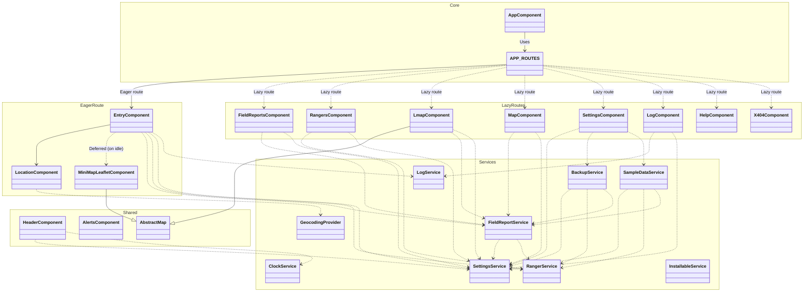

# RangerTrak Architecture

This document describes the high-level architecture of the RangerTrak application. It is
written for developers and assumes familiarity with Angular, bundling, and the codebase.

*Operators and Emergency Coordinators want [FIELD-GUIDE.md](FIELD-GUIDE.md) instead —
features, and how to prepare a device so the app works when the network doesn't.*

## Mapping engines

> **ADR D-56, accepted 2026-10-05 (John):** Leaflet is the primary engine and MapLibre the
> secondary one. New map features are Leaflet-only unless stated otherwise. MapLibre bugs are
> fixed within reason, when the fix is not hard. Whether to keep, freeze or retire MapLibre is
> not decided until after 1.0. The Entry mini-map is Leaflet-only, at least until 1.0.

RangerTrak ships **two independent map engines**. This is deliberate, not a migration
half-finished: they have genuinely different offline behaviour, and which one is the right
default for the Entry page is settled until 1.0 (see below).

Both engines live under the same `/map` route today (`MapPageComponent`, unified since
E-64) with a toggle between them — the table below used to show them as separate
`/mapLeaflet`/`/map` routes, which stopped being true at that point.

|                      | Leaflet (`LmapComponent`)                                     | MapLibre + PMTiles (`MapLibreComponent`)                              |
| -------------------- | -------------------------------------------------------------- | ---------------------------------------------------------------------- |
| Mini-map component   | `MiniMapLeafletComponent`                                       | `MiniMapComponent`                                                      |
| Basemap source       | OpenStreetMap/OpenTopoMap tile servers, over the network        | `src/assets/maps/world-z5-<build>.pmtiles`, bundled in the app, plus a loaded demo's `demo-<scenario>-<build>.pmtiles`, or a scribe-loaded custom `.pmtiles` file |
| Works offline        | Only for areas already viewed or explicitly saved               | **Yes, everywhere** — but only the bundled/loaded archive's own zoom range renders real detail; see the caching caveat below |
| Coverage             | Anywhere in the world                                           | Low-detail (z0–5) worldwide background always; street-level detail in a demo's area while that demo is loaded (E-124, 2026-09-26), or wherever a scribe loads their own `.pmtiles` file |
| Bundle cost          | ~150 kB                                                         | ~950 kB (lazy chunk, loaded with `/map`)                                |
| Clustering           | `leaflet.markercluster`                                         | Native GeoJSON clustering                                               |
| Offline tile caching | `leaflet.offline` — "Save this area for offline use" control (OpenTopoMap only; OSM's own policy forbids bulk saving) | Not needed for the bundled/background layer; a scribe-loaded custom file (`CustomPmtilesService`, Map page's "Load a custom .pmtiles file…") replaces coverage outright instead |

### Which engine powers the Entry page mini-map

> **Decided until 1.0 (ADR D-56, 2026-10-05): Leaflet.** The trade-off below is kept so it can
> be reopened after 1.0 without being rediscovered.

The Entry form has **one** mini-map slot. It currently uses `MiniMapLeafletComponent`
(Leaflet). `MiniMapComponent` (MapLibre) is built and working but not wired into
Entry's template — swapping them is a small change.

The trade-off is **offline capability, not speed**:

- The **MapLibre** mini-map works fully offline from the bundled PMTiles archive, from a
  cold start, with no network and no prior visit to that area — worldwide, at least at
  low (background) detail; see the coverage row above.
- The **Leaflet** mini-map needs OSM tiles from the network. It caches what it has already
  shown (via `leaflet.offline`), so it degrades to blank tiles for any area the operator
  has not previously viewed online.

For an emergency-operations tool — where the realistic failure mode is *the network is
down and the operator is entering a report* — that argues for MapLibre on the Entry page,
which is the one screen an operator uses continuously during a mission.

Load time is **not** a reason to prefer either one. MapLibre is roughly six times larger
than Leaflet, so switching would make the page heavier, not lighter — but since the
mini-map is wrapped in `@defer (on idle)` (see `entry.component.html`), neither engine is
in the initial download, and neither blocks the form from painting.

The cost of switching is street-level detail: the bundled files only have that for the demo
areas, and only while that demo is loaded (plus a low-res world background everywhere), so an
operator working anywhere real would get a background-only map where Leaflet would have shown real
streets given a network — unless a scribe-loaded custom `.pmtiles` file already covers that
area (Map page's "Load a custom .pmtiles file…"). Widening the BUNDLED default further is
tracked as the planned in-app region-download manager (Phase 2 of the offline map coverage
scoping doc).

**Leaflet until 1.0** (D-56). Revisit after 1.0, with this trade-off and the region-download
work in hand.

### Why both engines exist

Google Maps was dropped outright: it requires a paid API key and has no offline story.

Leaflet and MapLibre+PMTiles then deliberately ship **side by side** rather than one
replacing the other. They are not a migration in progress. Each has a real advantage the
other cannot match — Leaflet has worldwide coverage and better cartography but depends on
the network; MapLibre+PMTiles works from a cold start with no connection but only where an
extract has been bundled. Keeping both until real field use shows which serves this
audience better is the point, and Leaflet was given a genuine offline story (`leaflet.offline`,
wired up for real) specifically so the comparison is fair.

### Planned: downloadable map regions

The bundled default is a low-res world background (`world-z5-<build>.pmtiles`) plus one small
street-detail file per demo scenario, fetched only while that demo is loaded and the
Alternative map is open (E-124, 2026-09-26; built by `tools/build-demo-maps.sh`). Broader detailed coverage means
letting users download regions for their own area, and the approach is already settled
from prior art rather than open for invention:

- **Store tiles in OPFS (Origin Private File System), not the Cache API.** The Cache API
  has a hard ~50 MB per-partition cap, which disqualifies it for map data outright — an
  easy trap given the app already uses service-worker caching. OPFS reads a large
  `.pmtiles` file near-instantly without IndexedDB's memory overhead.
- **Target 10–100 MB per downloadable region**; whole-country archives are the wrong unit.
- **Zoom range is the dominant size lever** — z0–18 at country scale is 10–50× larger than
  z6–16. **z8–17 is the practical ground-operations range.**
- **Browser storage is evictable.** `navigator.storage.persist()` is already requested and
  its state surfaced in Settings; that mitigation stays essential here.
- **⚠️ Style resources are a separate problem.** Offline PMTiles plugins typically do *not*
  cache sprites and fonts — the service worker must handle those, or the map renders
  offline with missing icons and labels. Easy to miss until a field test fails.
- **Acquire regions before deployment, over good connectivity.** Large downloads failing
  over cellular is a more common failure than running out of storage.
- **Model the UI on OsmAnd's region-download flow** (zoom out, tap a region, see its size,
  download; separate Local / Downloads / Updates views) rather than designing it fresh.

## Geocoding

Address lookup is a **pluggable provider** (`GEOCODING_PROVIDER`), resolved once at boot in
`app.config.ts`:

- **Nominatim (OpenStreetMap) is the default** and needs no API key, keeping the app usable
  with zero setup. Its usage policy constrains the design: low volume, no per-keystroke
  autocomplete (hence the debounce on the address field), and visible attribution.
- **Google is used only if the user supplies their own key** in Settings, stored in that
  user's `localStorage` — never in the repo or the bundle.

**Geocoding is online-only by nature, and the UI must degrade honestly** — the providers
return an explicit "Address lookup requires Internet" result rather than appearing to fail
silently. Plus Codes and lat/long conversion are computed locally and keep working offline.

That gives the project its offline rule, which is worth stating plainly because it drives
several decisions: **coordinates always, addresses when connected.**

A permanent principle follows from this: **no API key is ever required for core function.**
Any key-requiring capability must be optional, must degrade honestly, and must never block
entering and mapping radio log entries. The current architecture satisfies this on every core
path — coordinates, Plus Codes, both map engines, Nominatim, and export/import are all
keyless.

## Theming: skins, tokens, and what must not vary

Five colour **skins** (`command` — the default — plus `ridgeline`, `nightwatch`, `sagebrush`,
`signal`) are switchable at runtime, in light or dark, and there are two layers to it that
meet at `:root`:

- **`--mat-sys-*`** — emitted by `mat.theme()` in `styles.scss`, called once per skin, each
  scoped to a `:root[data-skin="…"]` selector. This themes Material's own components.
- **`--rt-*`** — 47 tokens in `styles/_tokens.scss`, read by 34 component stylesheets. This
  themes everything Material does not. Values use CSS `light-dark()` rather than a
  `prefers-color-scheme` block, so a single declaration covers both schemes and neither is
  ever undefined.

`SkinService` sets `data-skin` on `<html>`, and **`assets/theme-init.js` sets it again before
Angular boots**, reading `skinChoice`/`themeMode` from `localStorage`. That file exists
because the CSP is `script-src 'self'` with no `'unsafe-inline'` — an inline `<script>` in
`index.html` would be blocked, and without it the app paints the default skin and then flips.

### The rule that is easiest to get wrong

Some tokens vary per skin and some deliberately do not, and putting a value in the wrong
group is a real bug rather than a style preference:

| Group | Varies per skin? | Why |
| --- | --- | --- |
| `--rt-ground/surface/ink/line/chrome` | **Yes** | They *are* the skin. |
| `--rt-accent` | **Yes** | The accent is the operator's chosen palette, and is contrast-checked for text. |
| `--rt-signal` | **No** | The brand orange in RangerTrak's mark. It has to match the favicon, the PWA tile and rangertrak.com, none of which can follow a runtime attribute. |
| `--rt-elapsed-1..7`, `--rt-readiness-*`, `--rt-status-*`, `--rt-notice-*` | **No** | Red means the same thing under every skin. A team that has gone quiet must not read differently because someone picked a different palette. |

`--rt-signal` is **not** an accent. It is 2.99:1 on white and fails as text — use
`--rt-accent` for anything interactive.

### Shared maths belongs beside its tokens, not in a component

The overdue check-in ramp is the worked example. Its band arithmetic now lives in
`shared/overdue.ts` and its colours in `_tokens.scss`, because all three consumers — the
Leaflet map label, the Rangers grid and the Radio Log — need the same answer. It previously
lived *inside* `mapLeaflet.component.ts` with its colours in that component's SCSS, which is
precisely why the two grids showed the same elapsed time as plain text with no warning: the
logic was unreachable from anywhere else.

### Two traps that have already cost time

- **A global class can lose to Leaflet on specificity.** Leaflet builds tooltip DOM itself,
  outside Angular's view encapsulation, so component-scoped rules never match it and a bare
  global `.rt-elapsed--N` ties with Leaflet's own `.leaflet-tooltip` background rule —
  winning or losing by stylesheet load order. `mapLeaflet.component.scss` keeps local
  selectors paired with `.leaflet-tooltip` for exactly this, and reads the shared tokens for
  the values.
- **Never use `var()` inside an SVG that ships as a file.** Renderers that only partly
  understand CSS (librsvg, some PDF and email pipelines) apply the declaration, fail to
  resolve the variable, and drop the attribute rather than falling back — the artwork
  silently disappears. `assets/icons/*.svg` therefore carry plain presentation attributes,
  with a `<style>` block only for motion. Verified against librsvg, where a `var()` fill made
  the mark's waves vanish entirely.

### Brand assets are generated, not hand-edited

`assets/icons/rangertrak-mark.svg` (plus `-animated` and `-tile`) are the masters. Every
raster beside them — `favicon.ico`, `apple-touch-icon.png`, `icon-*.png` — is produced from
those and should be regenerated rather than edited. `favicon.svg` is a deliberately separate,
simplified drawing rather than the mark scaled down: at 16px the full mark's three waves merge
into a smudge and the pin ring closes up.

## Encryption: exports, and now storage too

**Phase 1 shipped in 0.94.0: a mission backup can be encrypted on its way out.** The roster is
the sensitive part (legal names, personal phone numbers, photos, and call signs that resolve
to public licence records), and radio log entries can contain PII about missing persons.

**Phase 2a (E-122) moved where "at rest" lives.** The roster, radio log entries and locations -
`RangerService`, `RadioLogService`, `MissionLocationService` - live in IndexedDB
(`shared/storage/record-store.ts`, database `rangertrak-records`) behind `RecordStore`, a
synchronous in-memory cache over an async IndexedDB store, instead of directly in
`localStorage`. Mission settings (`appSettings`) and every UI-preference key stay on
`localStorage` - they hold no roster PII. That move was storage only, not encryption; it paid
for the async write path Phase 2b below needed.

**Phase 2b (opt-in, shipped): the roster and radio log entries can now be encrypted at rest, on
this device.** Mission → Data safety → **Device encryption** turns it on with a passphrase.
Turned on, `RecordStore` encrypts `rangers`/`radioLog`/`radioLog-BAD` (AES-GCM-256, a fresh IV
per write) right before each IndexedDB write and decrypts right after each read - the
in-memory `Map` every service reads/writes stays plaintext throughout, so no service changed.
Ranger photos (`ranger-photo.service.ts`, a separate database) are encrypted under the same
session key. `locations` and every `localStorage`-only key stay in the clear, unaffected -
see "Design sketch" and "The hard parts" below for why, and `shared/storage/
record-encryption.ts` for the actual primitives (a plaintext marker record with a PBKDF2 salt/
iteration count and an AES-GCM-encrypted verifier; the derived key is a non-extractable
`CryptoKey` held in memory only, for the session).

Turning it on or off, and the plain-DOM passphrase form `main.ts` shows before Angular boots
when the device is locked, are covered in the Help/FIELD-GUIDE copy for operators - this
section stays about the design.

### What shipped (Phase 1)

`shared/crypto/encrypted-file.ts` wraps any JSON payload in a self-describing envelope:
PBKDF2-SHA256 (OWASP's current iteration floor, **stored in the envelope** so it can rise
later without stranding old files), a fresh random salt and IV per file, and AES-GCM-256.

- **Opt-in, per export.** Mission → Back up mission offers a passphrase. **Leaving it blank
  writes the same plain file as before** — that is the default, and plain backups keep
  importing with no passphrase prompt at all.
- **Typed twice when set.** A typo is not discovered until the day someone needs the
  backup, by which point it is unrecoverable.
- **Detected structurally on import**, not by file extension, so a backup renamed in
  transit still opens. The `.rtenc.json` suffix is for humans reading a folder listing.
- **A small plaintext `hint`** (export date, app version) rides outside the ciphertext so a
  locked file is still identifiable.
- **AES-GCM is authenticated**: a tampered or truncated file fails to decrypt rather than
  producing plausible garbage the import path would then try to apply.

The commented-out `crypto-js` fragments in `utility.ts`, `settings.service.ts` and
`ranger.service.ts` are the remains of an earlier attempt and are superseded by this.

### Threat model — decide this first

There is **no server**, so "server breach" is not the threat. What encryption at rest
actually defends against here is narrow, and worth being honest about:

- ✅ **Lost or stolen device** — the realistic case, and the one that justifies the work.
- ✅ **A shared command-post laptop** where another user has access to the browser profile.
- ✅ **Exported files** distributed further than intended.
- ❌ **Not** an attacker who has the app open and unlocked — the key is in memory by
  definition.
- ❌ **Not** malicious code running in the page. Encryption at rest is not a substitute for
  the XSS fix already made on the Log page.

### Design sketch

- **Use the Web Crypto API (`crypto.subtle`), not `crypto-js`.** Done in Phase 1. It is native, audited, and
  already used elsewhere in this codebase for SHA-256. `crypto-js` is currently a
  dependency with **zero live call sites** — every use is commented out. It should be
  removed rather than left implying a capability that does not exist.
- **AES-GCM (256-bit)** for the data; **PBKDF2** with a high iteration count to derive the
  key from an operator passphrase; a random salt per store and a random IV per record,
  stored alongside the ciphertext.
- **The key lives in memory for the session only**, never persisted. Unlocking re-derives
  it from the passphrase.

### The hard parts, in order of cost

1. **`localStorage` is synchronous; Web Crypto is not.** ✅ Paid for by Phase 2a. Every
   service still writes synchronously inside `updateLocalStorageAndPublish()` /
   `updateRadioLogAndPublish()` - but that call now goes through `RecordStore`
   (`shared/storage/record-store.ts`), whose in-memory `Map` is synchronous to the caller
   while the actual IndexedDB write happens on its own async queue behind it. Phase 2b's
   `crypto.subtle.encrypt()` call belongs on that same async side (`RecordStore`'s write
   queue, right before the IndexedDB `put()`) - no service's write path needs to change
   again to make room for it.
2. **A forgotten passphrase destroys the mission record, permanently.** With no server
   there is no escrow and no reset. For a life-safety tool that failure mode may be worse
   than the exposure it prevents, so it must be designed for deliberately: keep encryption
   **opt-in per device**, and require any fresh backup - plain or passphrase-protected,
   either counts - before enabling it, so there is always a way back.
3. **Unlock friction must never land during a callout.** Same rule as the API-key
   principle: surface setup during mission preparedness, not when someone is on the radio
   waiting. A locked app that a scribe cannot open mid-incident is a worse outcome than an
   unencrypted one.
4. **Encrypt selectively.** The roster carries the concentrated risk; settings carry almost
   none. Encrypting the roster (and optionally reports) rather than everything reduces the
   blast radius of a lost passphrase and keeps the app usable if only part is locked.

### Suggested staging

- **Phase 1 — encrypted exports. ✅ Shipped 0.94.0 for the mission backup**, which is the
  file carrying the concentrated risk: it bundles the whole roster *and* the reports, and it
  is the one explicitly designed to move between devices. The roster and log CSV exports are
  **not** covered yet — encrypting those turns a spreadsheet-openable file into an opaque
  blob, which is a different UX question, and the backup already contains that data.
- **Phase 2a — ✅ moved the roster, radio log entries and locations off `localStorage` onto
  IndexedDB** (`RecordStore`, see above) - unencrypted still, but the storage refactor
  encryption needed was now done.
- **Phase 2b — ✅ opt-in encryption at rest**, tied to the IndexedDB migration so the async
  change was paid for once. See above.
- **Phase 3 — per-mission keys**, if agencies ask for separation between missions.

## Business rules: src/app/domain/

2026-10-01: the pure rules the app decides things by (first one: `deriveUsageState` and its
thresholds, E-168; second: `roster-changes.ts`, the import baseline and the changes-since-import diff) live in `src/app/domain/`, one plain TypeScript file per rule set, each with a
table-driven spec. The rule for this folder: **no Angular, Leaflet, DOM or storage imports** -
only data in, answer out - so a rule can be tested without a browser and is never decided in two
places. Services gather the inputs and call the rule. Since 2026-10-05 (ADR D-57, accepted that day; commit
`442b3ba`) ESLint enforces the import rule: the `domain/` boundary rule and its companion
(components reach storage only through services) are errors and gate CI, proven red with probe
files, in `eslint.config.mjs`. The recommended rule sets still only warn.

## Data stored on the device

Every persisted key, as of 2026-10-01 (E-168a). This is the input to the rc.1 storage freeze
(ADR D-55): any change here restarts that clock. "Backup" means the mission backup file
(`BackupService`); "Encrypted" means encrypted at rest when the operator has turned on a
passphrase (otherwise nothing here is encrypted). When IndexedDB is unavailable (private mode),
the `rangertrak-records` keys fall back to `localStorage` under the same names for that session.

| # | Store | Key | Owner | Backup | Encrypted | Migration |
|---|-------|-----|-------|--------|-----------|-----------|
| 1 | localStorage | `appSettings` | `mission.service.ts` | yes (`settings`; the geocoding key only in passphrase-protected backups) | no | `mission-migration.ts`, schema 5, plus backfill on every load |
| 2 | localStorage | `appSettings-BAD` | `mission.service.ts` | no | no | none; quarantine copy of unreadable settings |
| 3 | localStorage | `rangertrak-demo-scenario` | `shared/mapping/demo-map.ts` | no | no | JSON record since E-168a; the old bare scenario id still reads |
| 4 | localStorage | `fieldMode` | `field-mode.service.ts` | no | no | none |
| 5 | localStorage | `skinChoice` | `skin.service.ts` | no | no | none |
| 6 | localStorage | `themeMode` | `theme.service.ts` | no | no | none |
| 7 | localStorage | `entryWelcomeDismissed` | `welcome-panel.service.ts` | no | no | none |
| 8 | localStorage | `printTipShown` | `shared/export/print-tip.ts` | no | no | none |
| 9 | localStorage | `ics213DownloadFallbackExplained` | `shared/export/ics213-print.ts` | no | no | none |
| 10 | localStorage | `updateLastChecked` | `update.service.ts` | no | no | none |
| 11 | localStorage | `lastCoordinateFormat` | `device-prefs.service.ts` | no | no | none |
| 12 | localStorage | `rangertrak.rangers.privacyNoticeDismissed` | `device-prefs.service.ts` | no | no | none |
| 13 | IndexedDB `rangertrak-records` / `kv` | `rangers` | `ranger.service.ts` | yes | yes | `ranger-migration.ts`, schema 1 |
| 13a | IndexedDB `rangertrak-records` / `kv` | `rangersImported` (2026-10-05, import baseline: ranger uid -> field hash, no PII copied) | `ranger.service.ts` (`importBaselineKey`; pure logic in `domain/roster-changes.ts`) | no (deliberately: Restore mission does not write it, or it would hide the edits being looked for) | yes (with the roster) | none; new key. Written by roster import/merge, Setup files and the sample-mission loader; read by Rangers > Bulk roster tools > Export changes |
| 14 | IndexedDB `rangertrak-records` / `kv` | `radioLog` | `radio-log.service.ts` | yes | yes | `radio-log-migration.ts`, schema 1 |
| 15 | IndexedDB `rangertrak-records` / `kv` | `radioLog-BAD` | `radio-log.service.ts` | no | yes | none; quarantine copy of an unreadable log |
| 16 | IndexedDB `rangertrak-records` / `kv` | `locations` | `mission-location.service.ts` | yes | no | `mission-location-migration.ts`, schema 1 |
| 17 | IndexedDB `rangertrak-records` / `kv` | `aarNotes` | `aar-note.service.ts` | yes | yes | `aar-note-migration.ts`, schema 1 |
| 18a | IndexedDB `rangertrak-records` / `kv` | `secrets` (`{ googleGeocodingApiKey }`, 2026-10-01) | `mission.service.ts` | yes, as `settings.googleGeocodingApiKey`, passphrase-protected backups only | yes | one-time move out of `appSettings` on load |
| 18 | IndexedDB `rangertrak-records` / `kv` | `__encryption` | `shared/storage/record-store.ts` | no | no (it is the key marker) | none |
| 19 | IndexedDB `rangertrak-photos` / `photos` | one per ranger (by call sign) | `ranger-photo.service.ts` | yes (`photos`, base64; restoring replaces the device's photos) and in setup files | yes | none |
| 20 | IndexedDB `rangertrak-custom-pmtiles` / `files` | `active` | `custom-pmtiles.service.ts` | no | no | none |
| 21 | IndexedDB `leaflet.offline` / `tileStore` | map tiles | the `leaflet.offline` library | no | no | library's own |
| 22 | Cache Storage `rangertrak-pmtiles-warm` | map file URLs | `shared/mapping/demo-map.ts`, service worker | no | no | pruned by `pruneWarmCache()` |

Notes for the storage freeze:

- The optional Google geocoding API key is no longer in `appSettings` (2026-10-01): it lives in
  the `secrets` record, encrypted when device encryption is on. A plain backup omits it, a
  passphrase-protected one keeps it, and restoring a backup with no key keeps the device's key.
  Setup files still carry it by the 2026-08-31 decision.
- Mission mode (`missionMode`, E-168a) is a field inside `appSettings`, not a key of its own, so it
  rides in backups. The demo record (row 3) is device-only on purpose: it records which rows the
  demo loader created, which means nothing on another device.
- Rows 2 and 15 are written but nothing reads them back or cleans them up.

## One active tab per browser

Every domain service (`RangerService`, `RadioLogService`, `MissionLocationService`) keeps its
whole state in memory and persists it with one unconditional write on every mutation -
`RecordStore.setItem(key, JSON.stringify(wholeThing))`. That is fine within a single tab, but
two tabs of the same browser each load their own in-memory copy at boot; the second tab to
save always wins, silently discarding whatever the first tab wrote in between. Nothing
coordinated tabs before `shared/storage/tab-lock.ts` (2026-09-28) - no `BroadcastChannel`, no
`storage` event, no Web Lock.

The fix is a `navigator.locks` exclusive lock, requested `{ ifAvailable: true }` at the very
start of `main.ts` - before even the encryption gate above, since a tab that has not won the
lock has nothing to unlock or boot yet. Whichever tab holds it is the only one `RecordStore`
lets write: `setItem()`/`removeItem()` check a `writesEnabled` flag before touching either the
in-memory `Map` or IndexedDB, so nothing a blocked tab still has in memory can ever reach
storage. A tab that loses the startup race shows a full-page plain-DOM notice (same "no
Angular yet" reasoning as the encryption gate) offering to `steal` the lock instead; a tab that
was active and gets stolen from finds out because a `steal` rejects the *previous* holder's own
still-pending `navigator.locks.request()` promise (per the Web Locks API), which is this app's
only signal that it has been stolen from - no polling, no heartbeat. See `tab-lock.ts`'s own
header comment for the full mechanics, `tools/e2e.js`'s `checkOneActiveTab()` for the
two-real-tabs end-to-end proof, and the Help "Your data" tab for the operator-facing framing.

## Service worker and app updates

`UpdateService` (`shared/services/update.service.ts`) owns the update lifecycle and is
started once from `AppComponent.ngOnInit()`. On `VERSION_READY` it raises a persistent
snackbar, and `updateReady()` (a signal) drives `InstallUpdateComponent`
(`shared/install-update/`) — the one component now used for both "install this app" and
"a new version is ready" everywhere they appear: inline instances in the navbar, footer,
and Settings, plus one `[fixed]="true"` instance rendered once in `app.component.html`
that stays `position: sticky` at the top of the viewport regardless of scroll position or
route (E-43 — the navbar's own inline instance is `position: static` and was confirmed to
scroll out of view on any tall page). `SwUpdate.activateUpdate()` followed by
`location.reload()` runs only when the user accepts, from either surface.

The reload is deliberately never automatic. This is a scribe's tool used mid-incident;
replacing the page under an in-progress report would lose the report.

Anything that only `console.warn`s here is a bug, not a placeholder: a silently stale
service worker means an installed copy serves an old build indefinitely, which is exactly
what happened after 0.13.0 shipped.

## Bundle and loading strategy

Only the Entry route is eager; every other route is a `loadComponent` split point
(`src/app/app.routes.ts`). Two consequences worth knowing before adding imports:

- **Do not import heavy libraries from `main.ts`, `app.config.ts`, or anything in the
  Entry page's import graph** — that pulls them into the eager bundle and undoes the
  splitting. AG Grid registration lives in `shared/ag-grid-setup.ts` and xlsx is a dynamic
  import inside `RangerService` for exactly this reason.
- **Prefer specific import paths over the `shared/` barrels in eagerly-loaded code.** A
  barrel import pulls everything the barrel re-exports. `mapping/map-style` (MapLibre) is
  deliberately *not* re-exported from either barrel to keep this from happening by
  accident.
- **Keep map-engine types out of the domain model.** `FieldReportsType.bounds` was a
  Leaflet `LatLngBounds`, which put Leaflet in `FieldReportService` — and therefore in the
  eager bundle. It is a plain `BoundsType` now, converted to an engine's own type at the
  point of use. The same rule is why a plain object beats a class anywhere state is
  round-tripped through `localStorage`: JSON gives back data, never methods.
- **Leaflet must be evaluated before `leaflet.markercluster`.** The plugin reads the
  global `L` at module-evaluation time, so both Leaflet components carry a bare
  `import 'leaflet'` above the plugin import. It sorts first alphabetically, which keeps
  import-sort from reordering it. Removing that line reintroduces
  `ReferenceError: L is not defined`.

`app.config.ts` registers `withPreloading(PreloadAllModules)`, so lazy chunks are still
fetched once the app is stable — deliberate for an offline-first PWA, where everything
should end up precached. The split improves time-to-first-screen, not total bytes over a
whole session.

### First render of a routed page

2026-10-06 (E-171): under zoneless change detection `RouterOutlet` creates the routed page and
only marks it for check, so the page's first update pass (every `@if`, such as the page header,
and every binding) ran a task later, and a frame could paint in between without the header. That
was PageSpeed mobile CLS 0.49, fixed in 0.99.26-alpha to 0.002. `AppComponent.onRouteActivated()`
(`app.component.ts`), bound to `(activate)` on the router outlet, calls `ApplicationRef.tick()` so
the first pass runs in the activating task. Do not remove it without re-running PageSpeed mobile.
Local throttled runs never showed the problem: the race only appears on a fast load.

Solid arrows are eager; dashed arrows from `APP_ROUTES` are lazily loaded chunks.

> The diagram omits `MiniMapComponent` (the MapLibre mini-map): it exists and works but is
> not wired into any template yet — see the open decision above.
